# Javu: AI language-learning, built solo end-to-end

**A full-stack AI language-learning product: a React Native app, a Laravel/AWS backend, and a multilingual dictionary that _builds itself on demand_. Designed, built, and shipped solo.**

> **Founder-engineer.** I ship AI products end-to-end: systems architecture with a designer's eye.
> Javu is the proof, where I owned the product, the design, the full stack, the AI integration, and the release.

> **This repository is a case study: documentation, diagrams, and screenshots only. No application source code lives here.** It describes how Javu is built and the engineering decisions behind it.

  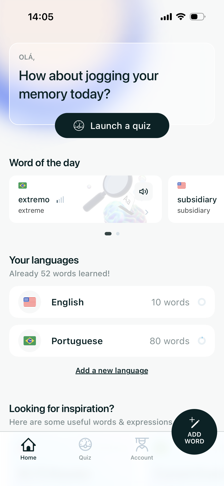
  &nbsp;
  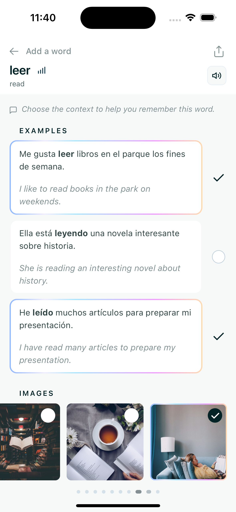
  &nbsp;
  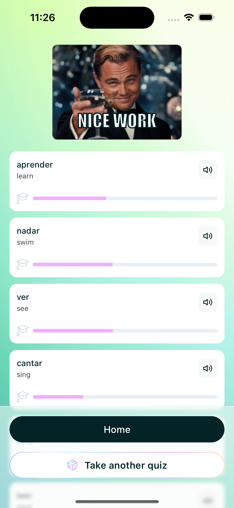

Home dashboard · the on-demand AI word view · end-of-session mastery

---

## What it is

Javu is a mobile app for learning vocabulary in a new language. You capture the words you actually care about (by searching a built-in dictionary, adding your own, or starting from a curated pack), and Javu turns each one into rich, multi-modal study material: graded definitions, natural example sentences, a translation into _your_ native language, synonyms and antonyms, imagery, and spoken pronunciation. It then schedules that material with spaced repetition so it sticks, and wraps the whole thing in streaks, ranks, daily challenges, and leaderboards to keep you coming back.

It's live on iOS and Android, with a Next.js marketing site at [javu.app](https://javu.app).

  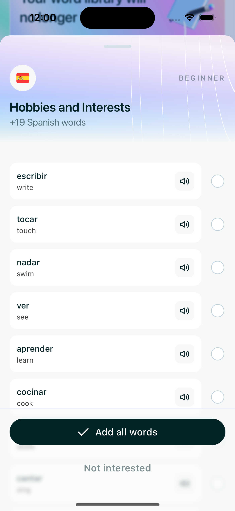

Capture words your way: search the dictionary, add your own, or start from a curated, level-graded pack.

### By the numbers

| | |
| --- | --- |
| **Languages** | 5 live in-app (English, Spanish, French, Italian, Portuguese), with 12 modelled in the data layer (more in progress) |
| **Dictionary** | ~1.4M word forms, **built on demand and cached** rather than pre-seeded |
| **Platforms** | iOS · Android · marketing website |
| **Recognition** | Daily winner on [Uneed](https://www.uneed.best/) |

Word-count and recognition figures are product data from the live system; the language counts are verifiable from the codebase (5 active, 12 defined in the language model).

  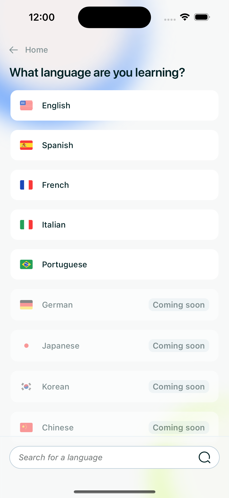

The live language picker: five active today, with more modelled and on the way.

---

## My role

**Everything built solo.** There was no team to divide this across:

- **Product**: scope, learning model, monetization, the whole feature set.
- **Design**: UI, motion, micro-interactions, brand, the marketing site.
- **Full-stack engineering**: React Native app, Laravel API, two databases, the AI pipeline, infrastructure.
- **AI integration**: orchestrating OpenAI, DeepL, and Google Cloud across a cached content pipeline.
- **Ship & operate**: App Store / Play releases (EAS), OTA updates, monitoring, backups, support.

The rest of this document is about the parts that were genuinely hard.

---

## The interesting part: a dictionary that builds itself

A vocabulary app needs a _real_ dictionary. For any word a learner cares about, in any of several languages, it has to produce:

- one or more **definitions**, graded to the learner's level (A1 → C2),
- natural **example sentences** at that level,
- a **translation** into the learner's native language,
- **synonyms and antonyms**,
- and a natural-sounding **pronunciation**.

Pre-building all of that (millions of words × languages × skill levels × native locales × media) is combinatorially enormous, expensive, and mostly wasted: the long tail is never looked at. So Javu doesn't pre-build it. **It materializes content the first time any learner needs it, then caches it permanently so every future learner gets it instantly and for free.**

### How it works

The corpus starts as a lightweight, **frequency-ranked skeleton**: `lexemes` (base dictionary forms) and their inflected `words`, seeded from frequency data and sources like Wiktionary. That skeleton is enough to _search, rank, and suggest_ words, but it carries almost no content. Everything else is filled in lazily, each provider doing what it's best at:

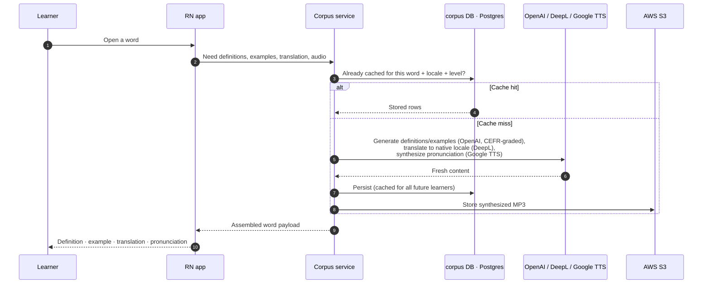

- **OpenAI (`gpt-5-mini`, structured outputs)** generates definitions, example sentences, and synonym/antonym sets, prompted to grade output to the exact CEFR band for the learner's skill level and to fit the UI's length budget. Results are validated (e.g. every example must actually contain the target word) before they're trusted.
- **DeepL** translates words, examples, and definitions into the learner's native locale, quality-optimized. Translations are filled in per-locale, on demand: a Portuguese learner and a Korean learner reading the same Spanish word each trigger (and cache) their own translation once.
- **Google Cloud Text-to-Speech (Chirp3-HD voices)** synthesizes pronunciation audio, with voice variety per word, stored as MP3 in S3 and served over CloudFront.
- **Unsplash** supplies imagery for visual word associations, with attribution tracked.

The corpus is a normalized, multilingual lexicon: content and its per-locale translations are separated so any number of native languages can be layered onto the same word without duplication.

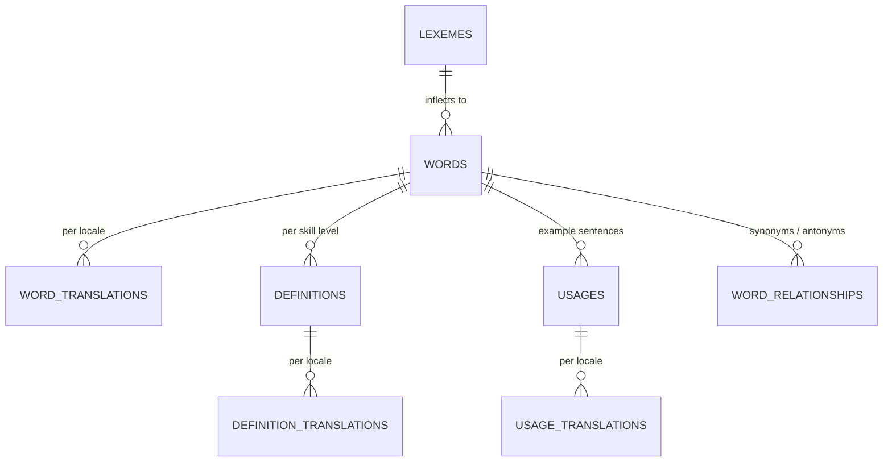

> The hero shot above (`leer` → _read_) is this pipeline's output: example sentences showing the word's real inflections (_leer_, _leyendo_, _leído_), each translated, with candidate images, all assembled on first view and cached forever after.

### Why this design

- **Cost and coverage that improve with use.** The marginal cost of a word trends to zero: the first learner to touch it pays the one-time generation cost; everyone after reads from cache. The product gets _richer and cheaper to run_ the more it's used, and adding a language is mostly a matter of seeding a skeleton and letting real usage fill it in, with no giant up-front content build.
- **Caching is layered, each tier doing one job.** Postgres is the durable cache (translations, definitions, examples, relationships, audio URLs); Redis caches hot lookups and short-lived selections; S3 holds generated audio; CloudFront serves media via **signed, expiring URLs** so paid/premium media isn't hot-linkable.
- **Quality is enforced at the seams.** Generated content is constrained (CEFR band, length, "don't use the word in its own definition"), structured (typed JSON, not free text), and validated before caching, so the cache stays clean even though it's machine-built.

### Fast, accent-tolerant search over a large corpus

Search has to feel instant and forgiving: typing `cafe` should find `café`. PostgreSQL's `unaccent` can strip accents, but it's only declared `STABLE`, so it **can't back an index**. Javu wraps it in a custom `IMMUTABLE` function (`immutable_unaccent`) and indexes _that_, enabling accent-insensitive prefix matching (`immutable_unaccent(value) ILIKE 'cafe%'`) that stays fast across millions of rows. Results use **cursor pagination** for stable infinite scroll, and suggestions / Word-of-the-Day use a **day-seeded RNG** so a "random" pick is stable for a whole day yet still paginates correctly.

---

## Architecture

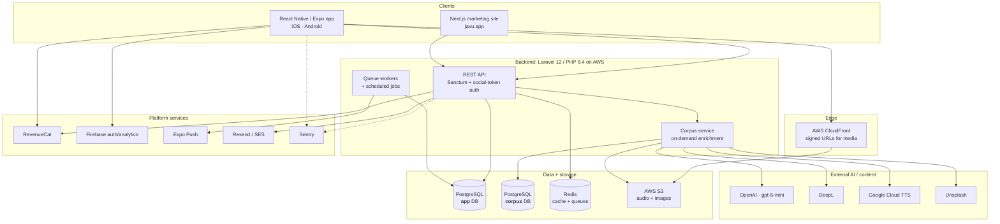

**Two PostgreSQL databases, on purpose.** Javu runs `app` and `corpus` as separate databases:

- **`corpus`** is a large, shared, append-mostly knowledge asset. _Every_ user reads from it, and it grows through caching. It contains no personal data, so it can be reused across all users, scaled for read-heavy access, and backed up on its own policy.
- **`app`** is private, mutable, per-account: users, their decks and notes, progress, streaks, gamification, billing state.

Splitting them isolates blast radius, keeps the reusable dictionary cleanly separated from personal data, and lets each database scale and back up independently. (The backend originally ran on MySQL and was migrated to PostgreSQL to take advantage of its indexing and extension ecosystem: `unaccent`, expression indexes, richer text search.)

**Other deliberate choices:**

- **Caching & queues on Redis**; heavier/external work (webhooks, prospect sync, notifications) runs through **queued jobs**, with **scheduled commands** driving the daily/weekly rhythm: streak ticks, leaderboard rollovers, Word-of-the-Day, email digests, pruning.
- **Auth** is Laravel **Sanctum** tokens, with social sign-in (Apple, Google, Facebook) verified server-side via JWT/ID-token checks.
- **Media delivery** goes through CloudFront with signed, short-lived URLs minted per request, so premium audio/imagery isn't freely shareable.
- **Billing** is **RevenueCat**, kept authoritative server-side via signed webhooks (freemium: free tier with ads via AdMob, premium subscription to unlock).
- **Observability**: Sentry on both app and API; automated database backups.

---

## The learning engine

Behind the simple "review your words" loop is a fair amount of machinery, all of it solo-built.

**Multi-format question generation.** For each word due for review, the backend generates questions across a matrix of **prompt formats** (show the word, or show a note about it) × **answer formats** (open typing, an on-screen letter **grid**, or **multiple choice**). Spelling-style formats are grouped so the same word isn't tested two near-identical ways in one session; multiple-choice distractors are drawn from the learner's _own_ deck so they're plausible; per-word caps keep a session diverse; order is shuffled.

  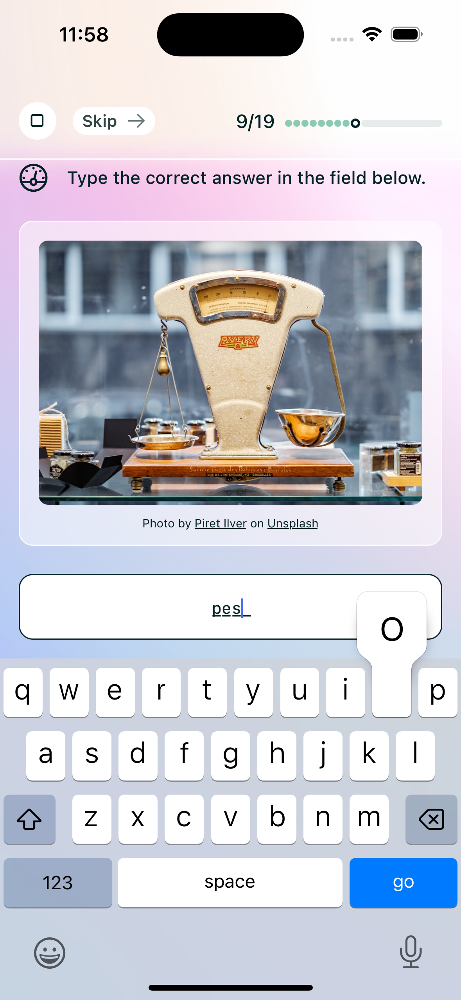
  &nbsp;
  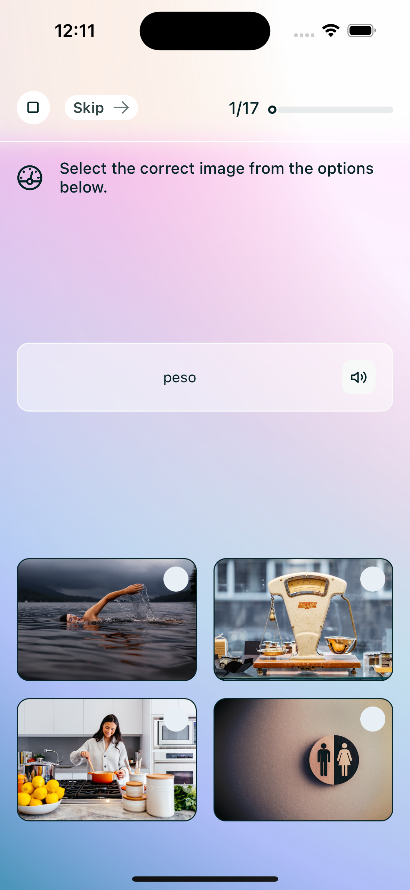
  &nbsp;
  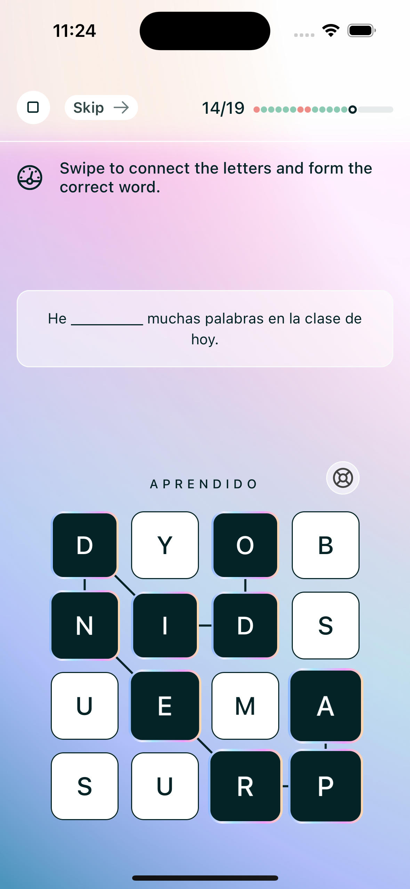

Three of the answer formats the engine mixes per word: open typing · image multiple-choice · swipe-to-spell letter grid.

**Research-grounded spaced repetition.** Each note carries a Leitner-style `box` and a `difficulty`. Review intervals follow a deliberately tuned schedule (fail → 10 min, then 1 day, 3 days, then exponential growth), referencing established spaced-repetition research. The scheduler is adaptive in several ways:

- **Answer difficulty is weighted**: a correct _typed_ answer (weight 1.8) advances a word more than a _grid_ answer (1.5), which beats _multiple choice_ (1.0). Recall that's harder earns more progress.
- **Hints cost you**: using a hint blocks promotion for that review; a word that was "too easy" double-promotes.
- **Difficulty adapts**: audio-only prompts appear only at higher boxes, starting hints only at lower ones.

  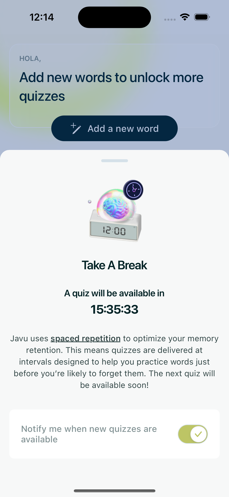

Spaced repetition, surfaced to the learner: the next session unlocks exactly when recall is predicted to dip.

**A progressive hint system that reveals intelligently.** Rather than dumping letters, hints work over a bitmask of the answer: with several hidden words it reveals whole parts (longest-first when there are many); with a single word it reveals letters (first, then random). The proportion revealed feeds back into scoring. It's a small thing the learner _feels_ as "the app is helping me, not doing it for me."

**Multi-modal notes & retention systems.** A word is learned through several note types (definition, example usage, synonym, antonym, translation, image) for varied exposure. Around the core loop sit XP (mastery-weighted), streaks, ranks, a daily **Word of the Day** per language and level, **arenas** and leaderboards, achievements, friends, and weekly email digests.

---

## Craft

Javu is built to _feel_ good, not just to function. Concrete examples, all in the React Native app:

- **Hand-tuned motion.** A small animation system mirroring Tailwind's easing curves, with deliberately short in/out timings (~80–100ms) so the UI feels crisp rather than floaty. Heavy or custom visuals (the letter-grid game, animated backgrounds, progress rings) use **Skia** and **Reanimated** for 60fps rendering off the JS thread; **Lottie** and confetti mark wins.
- **Haptics wired to meaning.** Light impacts on toggles, a success notification pattern on a correct answer: touch feedback tied to events, not sprinkled at random.
- **Honest offline behavior.** Network state is modelled explicitly (initialising / connected / disconnected) and surfaces a dedicated overlay instead of letting requests silently hang; large lists use FlashList; images fade in from blur-hash placeholders.
- **Pronunciation in the flow.** Synthesized audio plays inline on words and examples, so hearing a word is part of reviewing it.

---

## Stack

**App**: React Native · Expo (SDK 52, new architecture) · TypeScript · Expo Router · NativeWind (Tailwind) · React Query · Reanimated · Skia · Lottie · Expo AV · RevenueCat · Firebase · Sentry.

**Backend**: Laravel 12 · PHP 8.4 · PostgreSQL ×2 · Redis · Laravel Sanctum · queued jobs + scheduler · OpenAI · DeepL · Google Cloud TTS · Unsplash · AWS (S3, CloudFront, SES/SQS) · Resend · Sentry.

**Web**: Next.js 15 · React 19 · TypeScript · Tailwind · React Query · structured data (JSON-LD) for SEO.

---

## Status & links

- **Live** on iOS and Android; marketing site at **[javu.app](https://javu.app)**.
- **App Store**: https://apps.apple.com/us/app/javu-learn-words-your-way/id6743112606
- **Google Play**: https://play.google.com/store/apps/details?id=com.javu.app
- Daily winner on **[Uneed](https://www.uneed.best/)**.

---

Built solo by Dan Pugsley. This case study is documentation only and contains no source code, credentials, or proprietary prompt text.
